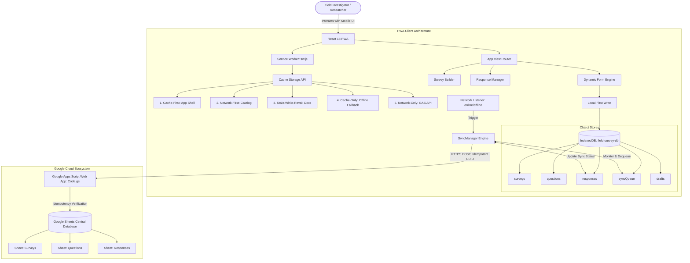
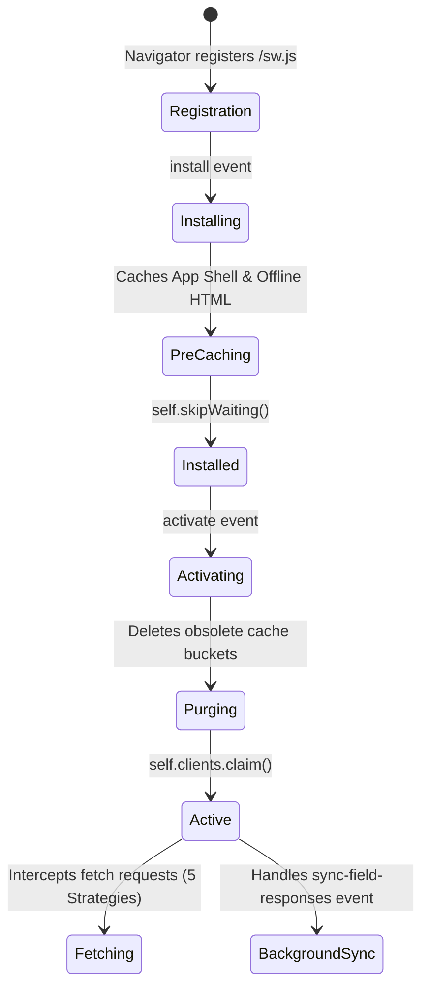
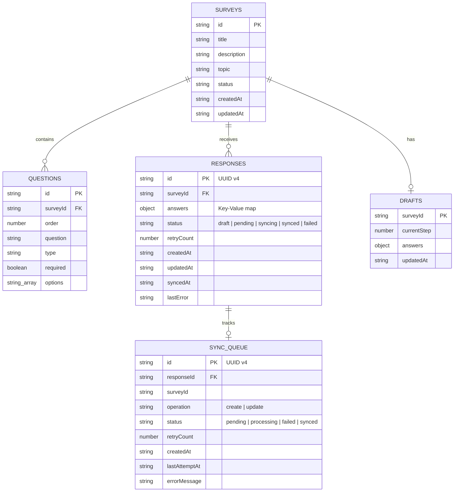
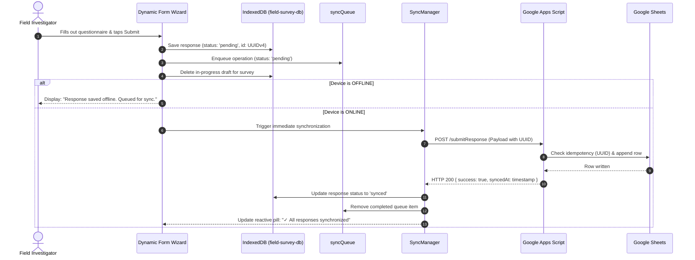

# FieldSurvey PWA

> **Offline-First Field Survey & Social Research Platform**  
> *University Final Project — Advanced Progressive Web Applications & Cloud Architecture*

[](https://fieldsurvey-pwa.pages.dev)
[](#pwa-architecture)
[](#indexeddb-architecture)
[](#google-apps-script-architecture)
[](#12-capacitor-android-architecture--build)
[](#technology-stack)
[](LICENSE)

---

## 1. Project Overview

**FieldSurvey PWA** is a resilient Progressive Web Application engineered specifically for real-world field investigations, social research, demographic census, campus audits, and facility inspections. In contrast to conventional web forms that require a persistent Internet connection, FieldSurvey PWA operates with a **local-first, offline-native architecture**.

Investigators can download or create dynamic surveys, journey into remote areas devoid of cellular reception, record detailed qualitative and quantitative observations (including camera photos), save in-progress drafts, and submit responses. The device saves all data safely inside **IndexedDB** and queues operations in a persistent **Sync Queue**. When Internet connectivity is restored, the application's synchronization engine autonomously pushes pending records to a centralized **Google Sheets** database via a **Google Apps Script Web App API** with idempotency guarantees.

---

## 2. Problem Statement

Field data collection in academic, governmental, and non-profit settings frequently encounters severe environmental constraints:
1. **Unreliable Field Connectivity:** Cellular signals drop out inside concrete university basements, rural survey zones, or remote inspection sites.
2. **Catastrophic Data Loss:** Standard web applications crash or lose form state upon connection dropouts during multi-step surveys.
3. **High Overhead of Traditional Backends:** Traditional relational databases (PostgreSQL, MySQL) require ongoing server management, complex credential distribution, and expensive cloud hosting that complicates collaboration with non-technical stakeholders.
4. **Hardcoded Form Inflexibility:** Many field survey tools hardcode one single questionnaire, requiring code deployments for every new study topic.

**FieldSurvey PWA solves these challenges** by pairing browser-native offline storage (`IndexedDB` + `Cache Storage`) with dynamic question-driven schemas and Google Sheets as an accessible, zero-cost, cloud-hosted relational datastore.

---

## 3. Key Features

- **100% Offline Capable:** Complete installation and operational capability without network connection.
- **Dynamic Question-Driven Form Engine:** Dynamically renders 10 distinct question types:
  1. Short Text
  2. Long Text / Observations
  3. Number (with min/max/step validation)
  4. Single Choice (Radio Card Chips)
  5. Multiple Choice (Multi-Select Chips)
  6. Yes / No (Segmented Action Buttons)
  7. Rating (Interactive 1–5 Star Rating)
  8. Date Picker
  9. Time Picker
  10. Photo Upload & Camera Capture (`<input type="file" accept="image/*" capture="environment">`)
- **On-Device Image Compression:** Downsamples captured camera photos to $\le 300\text{ KB}$ using HTML5 Canvas before persisting to IndexedDB.
- **Resilient Draft System:** Automatically preserves partial field responses; prompts investigators to resume where they left off or discard drafts upon reopening.
- **Persistent Offline Queue (`syncQueue`):** Queues responses locally with UUIDv4 tracking, timestamps, and retry counts.
- **Autonomous Synchronization Engine (`SyncManager`):** Reactive network restoration listeners (`online` event + Background Sync API fallback) with exponential backoff and deduplication.
- **Centralized Google Sheets Integration:** Serverless Google Apps Script Web App backend that automatically creates and manages "Surveys", "Questions", and "Responses" sheets.
- **Dual Cloud Mode:**
  - **Live Google Apps Script Integration:** Paste any deployed Apps Script URL.
  - **Mock Google Sheets Engine:** Zero-setup client simulator with live sheet row inspector for offline grading and instant presentations.
- **Admin Survey Builder:** Create, edit, reorder (Move Up/Down), delete questions, customize choice options, and preview questionnaires in real-time.
- **Response Management & CSV Export:** Filter by status (`Synced`, `Pending`, `Failed`), inspect answer details, retry failed items, and export datasets to CSV.
- **Global Network & Sync Ribbon:** Real-time visibility across all states: 🟢 Online, 🔴 Offline, 🔄 Syncing, ✓ Synced, ⚠ Pending.

---

## 4. System Architecture



---

## 5. Technology Stack

| Layer | Technology | Purpose |
| :--- | :--- | :--- |
| **Frontend Framework** | React 18.3 + TypeScript 5.7 | Component architecture, strict type checking |
| **Bundler & Build Tool**| Vite 6.1 | Lightning fast HMR, production PWA tree shaking |
| **Local Offline DB** | IndexedDB via `idb` v8.0 | Structured, transactional offline storage |
| **PWA Service Worker** | Native Service Worker (`sw.js`) | Lifecycle handling, 5 cache strategies, background sync |
| **Styling & Design** | Pure Vanilla CSS Tokens | Responsive mobile ergonomics, zero runtime bloat |
| **Icons** | Lucide React | Clean, scalable visual indicators |
| **Cloud Database** | Google Sheets | Accessible, collaborative, free cloud relational store |
| **Backend API** | Google Apps Script (`Code.gs`)| Lightweight serverless REST-like endpoint (`doGet`/`doPost`) |

---

## 6. PWA Architecture & Service Worker Lifecycle

FieldSurvey PWA implements the full Service Worker lifecycle as specified in modern PWA standards:



---

## 7. The Five Caching Strategies

FieldSurvey PWA demonstrates explicit, deliberate implementation of all 5 caching strategies in `public/sw.js`:

| # | Strategy | Route / Asset Pattern | Reason & Architecture Justification |
| :-: | :--- | :--- | :--- |
| **1** | **Cache-First** | App Shell (`/`, `/index.html`, `/assets/*.js`, `/assets/*.css`, `/icons/*`, Google Webfonts) | Critical for instant offline boot. Assets are hashed; cache provides instantaneous rendering without waiting for round-trip latency. |
| **2** | **Network-First** | Dynamic Survey Catalog (`/api/surveys`, catalog endpoints) | Always attempts to retrieve newest surveys published by researchers. If network drops or times out (3.5s), falls back to cached definitions. |
| **3** | **Stale-While-Revalidate** | Survey Templates & Documentation (`/templates/*`, `/docs/*`) | Returns cached template instantly for zero-latency UI rendering, while asynchronously fetching updates in background to keep cache fresh. |
| **4** | **Cache-Only** | Offline Emergency Fallback (`/offline.html`) | Serves emergency fallback state strictly from cache without initiating a futile network request when disconnected. |
| **5** | **Network-Only** | Google Apps Script Endpoints (`/macros/s/*`, `/submitResponse`, POST requests) | Submissions must NEVER be served from cache. Stale POST responses would violate data integrity and idempotency. |

---

## 8. IndexedDB Architecture

Database: `field-survey-db` (Version 1)



---

## 9. Offline-First Flow vs. Synchronization Flow

### Offline Submission Pipeline



---

## 10. Google Apps Script Architecture & Sheets Structure

The serverless backend is encapsulated in `server/google-apps-script/Code.gs`.

### Sheet Schema

1. **"Surveys" Sheet:**
   `surveyId` | `title` | `description` | `topic` | `status` | `createdAt` | `updatedAt`

2. **"Questions" Sheet:**
   `questionId` | `surveyId` | `order` | `question` | `type` | `required` | `options`

3. **"Responses" Sheet:**
   `responseId` | `surveyId` | `createdAt` | `receivedAt` | `syncedAt` | `answersJson` | `summaryAnswers`

### Idempotency Guarantee
When a submission reaches Google Apps Script, the function `recordSurveyResponse(response)` scans Column A (`responseId`) in the "Responses" sheet.
- If the UUID already exists: it logs the idempotency hit and returns `{ success: true, duplicate: true, responseId: ... }` without creating duplicate rows.
- If new: it appends the row and returns `{ success: true, duplicate: false, syncedAt: ... }`.

---

## 11. Installation & Running Locally

### Prerequisites
- Node.js 18+ (tested on Node v24)
- npm 9+

### Step-by-Step Setup

```bash
# 1. Clone repository or navigate to workspace
cd d:/Project/mobile/survey-pwa

# 2. Install dependencies
npm install

# 3. Start development server
npm run dev

# 4. Or test production PWA bundle (with active Service Worker)
npm run build
npm run preview
```

Open [http://localhost:5173](http://localhost:5173) (or preview port [http://localhost:4173](http://localhost:4173)).

---

## 12. Cloudflare Pages Production Deployment

FieldSurvey PWA is deployed and publicly accessible via Cloudflare Pages:

- **Live Production URL:** [https://fieldsurvey-pwa.pages.dev/](https://fieldsurvey-pwa.pages.dev/)
- **Alternative Deployment Hash:** `https://bc953e08.fieldsurvey-pwa.pages.dev`
- **Protocol:** Enforced HTTPS with SSL / TLS Edge Certificates
- **SPA Fallback:** Handled via `public/_redirects` (`/* /index.html 200`)
- **PWA Capabilities:** Service Worker registration, offline caching, and add-to-homescreen standalone installation verified live.

### Deployment Commands:
```bash
# 1. Build optimized production PWA bundle
npm run build

# 2. Deploy directly using Wrangler to Cloudflare Pages
npx wrangler pages deploy dist --project-name=fieldsurvey-pwa
```

---

## 13. Capacitor Android Architecture & Build

The application provides dual-target support: **Browser PWA** and **Native Android APK**.

```text
               User Interaction
                      │
       ┌──────────────┴──────────────┐
       ▼                             ▼
  Web Browser (PWA)           Native Android
 (HTML File Input)         (@capacitor/camera)
  (window.online)         (@capacitor/network)
       │                             │
       └──────────────┬──────────────┘
                      ▼
         Unified Platform Services
       (cameraService, networkService)
                      │
                      ▼
                 SyncManager
```

- **App Package ID:** `com.vku.fieldsurvey`
- **App Name:** `FieldSurvey PWA`
- **Native Plugins:**
  - `@capacitor/camera`: Platform-aware camera capture (prompts Camera or Gallery on Android; native file input on web).
  - `@capacitor/network`: Native connection listener feeding into the unified `SyncManager`.

### Building the Android APK:
```bash
# 1. Build production web assets
npm run build

# 2. Sync web assets and plugins to Android project
npx cap sync android

# 3. Compile the debug APK using Gradle (Windows PowerShell)
cd android
.\gradlew.bat assembleDebug

# Output APK path:
# android/app/build/outputs/apk/debug/app-debug.apk
```

---

## 14. Google Apps Script Setup Guide

To connect FieldSurvey PWA to your own Google Sheet:

1. Create a new Google Sheet at [sheets.new](https://sheets.new) (e.g. named `FieldSurvey Production DB`).
2. Open **Extensions** $\rightarrow$ **Apps Script**.
3. Overwrite `Code.gs` with the code from [`server/google-apps-script/Code.gs`](server/google-apps-script/Code.gs).
4. Click **Deploy** $\rightarrow$ **New deployment**.
5. Choose type: **Web app**.
   - **Execute as:** `Me`
   - **Who has access:** `Anyone`
6. Click **Deploy** and copy the Web App URL (ends with `/exec`).
7. Set `VITE_GOOGLE_APPS_SCRIPT_URL` in `.env` or in FieldSurvey PWA navigate to **Config** (Settings tab) $\rightarrow$ Paste your URL $\rightarrow$ Click **Save URL** $\rightarrow$ Click **Test Connection**.

---

## 13. Step-by-Step Demonstration Scenario

Follow this exact walkthrough during your presentation or evaluation:

1. **Online Inspection:** Open `http://localhost:4173/`. Verify the top status banner displays `🟢 Online • Ready to collect`.
2. **First Online Submission:**
   - Tap **"Da Nang Student Lifestyle Survey"**.
   - Answer the 8 questions using the dynamic wizard.
   - On the Review step, verify all answers and tap **Submit Response**.
   - Observe the immediate `"Submission Synchronized!"` confirmation and green **`Synced`** badge in Responses.
   - Open **Config** $\rightarrow$ Inspect the **Simulated Google Sheet** table to see Row #2 populated.
3. **Simulating Field Disconnection:**
   - Open Chrome DevTools (`F12`) $\rightarrow$ **Network** tab $\rightarrow$ Set Throttling to **Offline** (or toggle device airplane mode).
   - Refresh the page ($Ctrl+R$ / $F5$).
   - **Notice:** The application loads immediately from the Service Worker Cache Storage!
4. **Offline Field Submission:**
   - Notice the status ribbon shows `🔴 Offline • Responses will be saved to device`.
   - Open the **"Campus Facility & Infrastructure Inspection"** survey.
   - Enter building, room, issue description, and capture a photo evidence.
   - Tap **Submit Response**.
   - Notice the prompt: `"Response Saved Locally"`.
   - Tap **View Responses**: Notice the status is `PENDING SYNC` with an amber badge.
5. **Inspect IndexedDB:**
   - In DevTools $\rightarrow$ **Application** $\rightarrow$ **IndexedDB** $\rightarrow$ `field-survey-db`.
   - Inspect the `responses` store (see the pending response) and `syncQueue` store (queued item).
6. **Network Restoration & Auto-Sync:**
   - In DevTools Network tab, switch back from **Offline** to **Online** (No throttling).
   - Observe: A toast instantly pops up: `"🟢 Connection restored. Synchronizing pending responses..."`.
   - The status pill transitions automatically: `PENDING` $\rightarrow$ `SYNCING` $\rightarrow$ `SYNCED`.
   - Open **Config** $\rightarrow$ See the new row populated in Google Sheets!
7. **Fault-Tolerance / Retry Demonstration:**
   - In **Config**, toggle **"Simulate Network / Remote Cloud Failure"**.
   - Submit a response $\rightarrow$ Sync will fail gracefully, marking status as `Failed` without losing data.
   - Untoggle failure simulation $\rightarrow$ Tap **Retry** in Responses $\rightarrow$ Status recovers to `Synced`.

---

## 14. Project Structure

```text
survey-pwa/
├── public/
│   ├── icons/
│   │   ├── icon.svg            # Scalable SVG brand icon
│   │   ├── icon-192.png        # Standard 192px PWA icon
│   │   └── icon-512.png        # Standard 512px maskable PWA icon
│   ├── manifest.json           # W3C Web App Manifest
│   ├── offline.html            # Cache-Only emergency fallback
│   └── sw.js                   # Service Worker with 5 caching strategies
├── server/
│   └── google-apps-script/
│       └── Code.gs             # Serverless Google Sheets Web API backend
├── src/
│   ├── components/
│   │   ├── drafts/
│   │   │   └── DraftResumeModal.tsx
│   │   ├── form/
│   │   │   └── DynamicSurveyForm.tsx
│   │   ├── layout/
│   │   │   ├── AppHeader.tsx
│   │   │   ├── BottomNav.tsx
│   │   │   └── NetworkStatusBar.tsx
│   │   └── questions/
│   │       └── QuestionRenderer.tsx
│   ├── context/
│   │   └── SyncContext.tsx
│   ├── db/
│   │   ├── indexedDB.ts        # Database connection & schema migration
│   │   ├── seedData.ts         # Preloaded university demo surveys
│   │   └── repositories/
│   │       ├── draftRepository.ts
│   │       ├── responseRepository.ts
│   │       ├── surveyRepository.ts
│   │       └── syncQueueRepository.ts
│   ├── hooks/
│   │   └── useSurveyDraft.ts
│   ├── pages/
│   │   ├── DashboardPage.tsx
│   │   ├── ResponsesPage.tsx
│   │   ├── SettingsPage.tsx
│   │   ├── SurveyBuilderPage.tsx
│   │   ├── SurveyFillPage.tsx
│   │   └── SurveysListPage.tsx
│   ├── services/
│   │   ├── googleSheetsApi.ts
│   │   ├── responseService.ts
│   │   ├── serviceWorkerRegistration.ts
│   │   └── syncManager.ts
│   ├── styles/
│   │   └── index.css           # Design tokens & responsive layout
│   ├── types/
│   │   └── survey.ts
│   ├── utils/
│   │   └── imageCompression.ts
│   ├── App.tsx
│   └── main.tsx
├── index.html
├── package.json
├── tsconfig.json
├── vercel.json
├── vite.config.ts
├── README.md
└── TECHNICAL_REPORT.md
```

---

## 15. Limitations & Future Improvements

### Current Limitations
1. **Google Sheets Maximum Row Limits:** Google Sheets supports up to 10 million cells. For municipal censuses with hundreds of thousands of responses, an eventual migration to BigQuery or Cloud SQL is advised.
2. **Photo Data URL Size in Sheets:** Because cells in Google Sheets hold up to 50,000 characters, high-resolution base64 photos are summarized in the primary row while compressed thumbnails are maintained in IndexedDB.
3. **Background Sync Browser Support:** Background Sync API is fully supported on Chromium-based mobile browsers (Chrome, Edge) but relies on standard `online` window events in WebKit (iOS Safari).

### Future Roadmap
- Direct integration with Google Drive API for uploading full-resolution photos directly to a designated Drive folder.
- GPS Geolocation question type with offline map tile caching via Leaflet/MapLibre.
- End-to-end cryptographic payload signing for legal chain-of-custody audits.

---

## 16. License

This project is licensed under the MIT License — designed for university evaluation and open-source field research.
